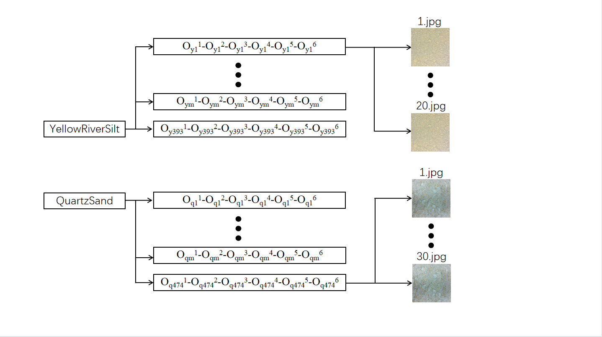

# *BJTU gradation photos*

## Description

​	It is a database linking the surface photo of soil and soil grain size distribution. It containing 22080 pictures for soil of total 867 grain size distributions. 

## Contributors

​	This databased are collected by Dr. Xu Li’s research team independently. The contributors of this database include Mr. Yuan-en Pang, Mr. Guo-dong Shi, Mr. Yu Duan, Mr. Hao-ze Ji, Mr. Mao-biao Li, Mr. Ming Luo and Mrs. Min Yao are involved in the data collection.

## Copyright and data sharing policy

​	You can freely download and use this database for scientific research and other non-commercial purposes. When you use this database, you must declare the source of data, as the following form: “Great thanks is giving to ***BJTU gradation photos*** shared by Xu Li’s research team from Beijing Jiaotong University. The detailed introduction of this database can be found in the following journal Paler: Recognizing gradations of coarse soils 674 based on big artificial samples and deep learning”. If you wish to use this database in commercial purpose, please contact with [cexuli2012@gmail.com](mailto:cexuli2012@gmail.com) and ask for the permission.

## Introduction

​	There are two directories named “YellowRiverSilt” and “QuartzSand”, which store data about two types of soil respectively. “YellowRiverSilt” contains the surface photos of soil mixed from the particles of yellow river silt. “QuartzSand” contains the surface photos of soil mixed from the particles of quartz sand.

## Details

Here are some details about gradation dataset:

1. The following Fig.1 shows the structure of directory. 

   

   
<b>Fig.1 The structure of the database</b>

2. In “YellowRiverSilt” directory, there are 393 sub-directories. 

   a) In each sub-directory, 20 surface photos are stored as the surface photos taken from a soil with same grain size distribution. 

   b) The name of each directory is the label, i.e. the grain size distribution of these pictures. For Yellow River silt, particle size is divided into six ranges: 6-4.75mm, 4.75-3.15mm, 3.15-2.36mm, 2.36-1.18mm, 1.18-0.6mm, 0.6-0.3mm. For quartz sand, it’s 25-10mm, 10-5mm, 5-1mm, 1-0.5mm, 0.5-0.25mm, 0.25-0.075mm. For example: Oym1-Oym2-Oym3-Oym4-Oym5-Oym6 means the mass proportion of soil particles between 6.00-4.75mm is Oym1(%), 4.75-3.15mm is Oym2(%), …, 0.6-0.3mm is Oym6(%).

3. Similarly, in “QuartzSand” directory, surface photos of soil with 474 grain size distributions are stored. For each soil grain size distribution, 30 surface photos are taken. 

4. All surface Photos are all saved in form of JPG, and the size is 1000×1000.

5. Photos in same sub-directory have same label, i.e. same grain size distribution.

6. In QuartzSand, two sub-directories(0.00_0.00_0.00_0.00_0.00_100.00 and 100.00_0.00_0.00_0.00_0.00_0.00)are repeated some times, so we name them 0.00_0.00_0.00_0.00_0.00_100.00@2、0.00_0.00_0.00_0.00_0.00_100.00@3 and et al. In fact, the photos contained in repeated directory are different, you needn't to worry.

   ## Contact information

   [cexuli2012@gmail.com](mailto:cexuli2012@gmail.com)
